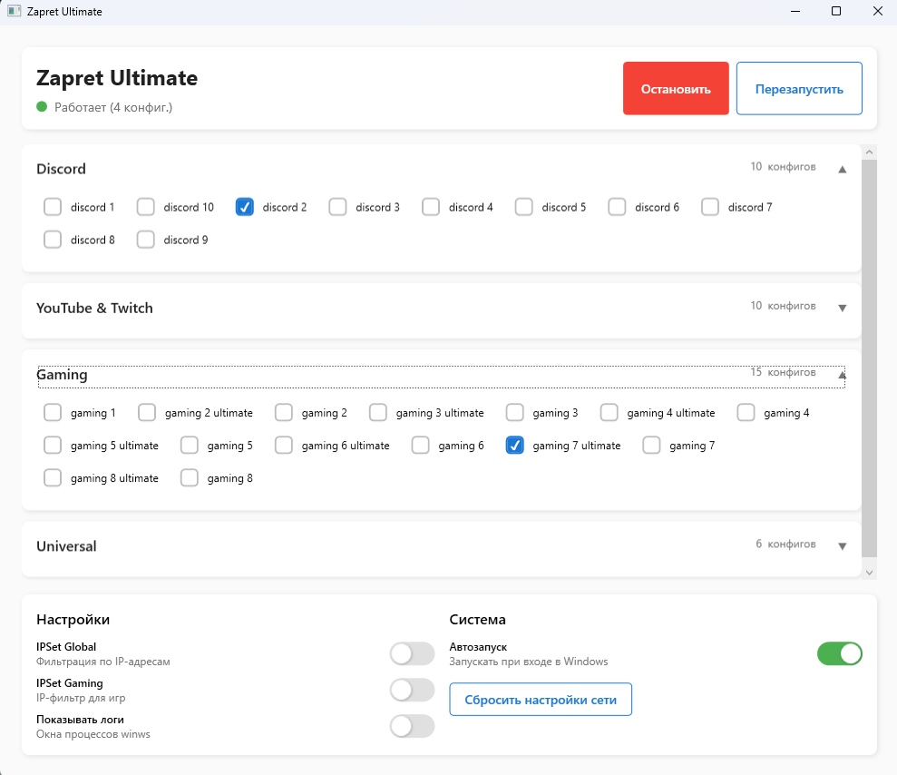

# Zapret Ultimate

Современный GUI интерфейс для управления Zapret - инструмента обхода DPI блокировок.



*Главное окно приложения: выбор конфигов по категориям, статус работы и настройки*

## Возможности

- 🖥️ Удобный графический интерфейс
- 🔧 Выбор конфигов по категориям (Discord, YouTube/Twitch, Gaming, Universal)
- 📌 Сворачивание в системный трей
- 🚀 Автозапуск при старте Windows
- ⚙️ Настройки IPSet (Global и Gaming)
- 🔄 Сброс сетевых настроек
- 🛡️ Обнаружение конфликтующих программ (GoodbyeDPI, VPN и др.)

## Требования

- Windows 10/11 (также поддерживается Windows 7/8)
- .NET 8.0 SDK (для сборки)
- Права администратора (для работы WinDivert)

## Установка .NET 8.0 SDK

1. Скачайте .NET 8.0 SDK с официального сайта:
   https://dotnet.microsoft.com/download/dotnet/8.0

2. Установите SDK и перезапустите терминал

## Сборка проекта

```powershell
# Восстановление зависимостей
dotnet restore

# Сборка
dotnet build

# Сборка релизной версии
dotnet publish -c Release -r win-x64 --self-contained
```

## Копирование ресурсов

После первой сборки необходимо скопировать ресурсы из оригинального Smart-Zapret-Launcher:

```powershell
# Запустите PowerShell скрипт
.\copy-assets.ps1
```

Или вручную скопируйте:
- `bin/` - исполняемые файлы (winws.exe, WinDivert.dll и др.)
- `configs/` - конфигурационные файлы
- `lists/` - списки доменов и IP-адресов

## Структура проекта

```
zapret-ultimate/
├── src/
│   └── ZapretUltimate/
│       ├── Models/           # Модели данных
│       ├── ViewModels/       # ViewModels (MVVM)
│       ├── Views/            # XAML представления
│       ├── Services/         # Сервисы (процессы, сеть, автозапуск)
│       ├── Converters/       # WPF конвертеры
│       └── Resources/        # Ресурсы и стили
├── ZapretUltimate.sln        # Solution файл
└── copy-assets.ps1           # Скрипт копирования ресурсов
```

## Использование

1. Запустите приложение от имени администратора
2. Выберите нужные конфиги в каждой категории
3. Нажмите "Запустить"
4. Приложение будет работать в системном трее
5. При закрытии окна приложение сворачивается в трей
6. Для полного выхода используйте контекстное меню в трее → "Выход"

## Автозапуск

Включите опцию "Автозапуск" в настройках. Приложение будет:
- Запускаться при входе в Windows
- Автоматически запускать выбранные конфиги
- Работать в фоновом режиме (в трее)

## Настройки

- **IPSet Global** - использовать IP-фильтрацию для общих конфигов
- **IPSet Gaming** - использовать IP-фильтрацию для игровых конфигов
- **Показывать логи** - отображать окна процессов winws
- **Автозапуск** - запускать приложение при старте Windows
- **Сбросить настройки сети** - очистка прокси, DNS кеша и Winsock

## Лицензия

MIT License

## Благодарности

- [Zapret](https://github.com/bol-van/zapret) - оригинальный инструмент обхода DPI
- [Smart-Zapret-Launcher](https://github.com/Bl00dLuna/Smart-Zapret-Launcher) - консольный лаунчер
